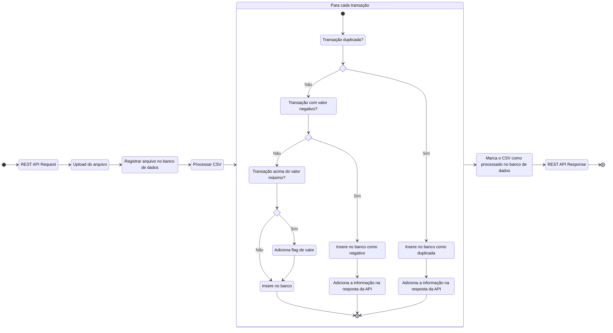

## Algoritmo implementado



## Database

Para iniciar o banco de dados:

```sh
docker compose up -d
```

Todas as credenciais se encontram no arquivo `.env` na raíz do projeto. A estrutura do banco será criada automaticamente.

## Executar

```sh
npm run start
```

A API será exposta na porta 3000 fornecendo o endpoin `POST /upload` que recebe o arquivo no campo `file`.

Um arquivo `.csv` modelo está disponível em `/test/model.csv`.
